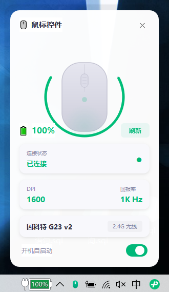

# 鼠标控件小组件

**解决的核心痛点：无线鼠标看不到电量，不注意突然没电会影响使用。**

个人折腾的 PyQt5 桌面小组件，用于实时监控因科特 G23 v2 无线鼠标的电量、DPI 和回报率等状态，随时掌握鼠标电量，告别突然断电。




> **本项目由 AI 辅助开发完成**，包括协议逆向分析、代码编写和 UI 设计。

## 功能

- 显示鼠标电量百分比（多次采样取最小值，过滤 ADC 噪声）
- 显示当前 DPI 和回报率
- 显示连接状态（2.4G 无线 / 有线充电）
- 界面内鼠标图形跟随真实按键动作（左键/右键/滚轮高亮）
- 设置面板（所有设置通过 QSettings 持久化，重启自动恢复）：
  - 开机自启动开关
  - 低电量警告阈值（10%/15%/20%/25%/30%）
  - 数据刷新间隔（5/10/15/30 分钟）
  - 关闭窗口行为（最小化到托盘 / 直接退出）
  - 低电量弹窗通知开关
- 系统托盘最小化（关闭按钮最小化而非退出）
- 手动刷新数据
- 自定义鼠标形状任务栏/托盘图标
- 单实例运行（防止重复启动产生多个托盘图标）

## 数据刷新策略

- **启动时**：立即读取一次全部状态
- **自动刷新**：按设置的间隔时间（默认 10 分钟）缓存过期后自动重新读取
- **手动刷新**：点击刷新按钮强制读取

## 环境要求

- Windows 10/11
- Python 3.8+
- 因科特 G23 v2 鼠标（VID: `0x093A`, PID: `0x522C` / `0x622C`）

> 其他使用 PIXART 传感器的鼠标可能支持类似协议，但需自行验证。

## 安装

```bash
pip install -r requirements.txt
```

## 运行

```bash
python main.py              # 正常启动
python main.py --autostart  # 最小化启动（开机自启用）
python main.py --install    # 注册开机自启动
python main.py --uninstall  # 取消开机自启动
```

或双击 `启动鼠标控件.bat`（无黑窗）。开机自启动也可通过界面内开关或托盘菜单设置。

## 技术原理

通过 HID Feature Report 与鼠标私有协议通信：

- **Report ID**: `0x09`
- **读取命令**: `[0x09, 0x89, 0x00, 0x00, 0x00, 0x00, 0x00, 0x00, 0x00]`
- **必须使用** Usage Page `0xFF05` 的第二个 Collection (Col02)

详见 [protocol_analysis.md](protocol_analysis.md)。

## 项目结构

```
├── main.py              # 入口文件，自启动管理
├── mouse_widget.py      # UI 界面（PyQt5 自定义绘制）
├── battery_monitor.py   # HID 通信与状态监控
├── protocol_analysis.md # 协议逆向分析文档
├── requirements.txt     # Python 依赖
├── 启动鼠标控件.bat      # Windows 启动脚本（无黑窗）
├── 示例图片.png          # 界面截图
├── LICENSE              # MIT 许可证
└── .gitignore
```

## 已知限制

- 该鼠标固件不通过 HID 报告充电状态，插线后电量直接显示 100%
- 电量读数有 ±1% 的 ADC 波动，已取多次采样最小值处理
- 通过网页驱动修改 DPI 后，需点击刷新或等待缓存过期才能更新显示
- 当前仅支持读取 DPI 和回报率，暂不支持在控件内直接修改（需通过官方网页驱动操作）

## TODO

- [ ] 用 Go 重写为单个 exe（免 Python 环境，启动更快、内存更小）
  - HID 库: `github.com/karalabe/hid`
  - GUI 框架候选: Fyne / Wails / Walk
- [ ] 支持更多 PIXART 传感器鼠标型号

## 贡献须知

- HID 通信必须使用 `Usage Page 0xFF05` 的 **Col02** 接口，Col01 不稳定会返回错误数据
- 涉及 HID 读取的操作必须放在异步线程中，通过 PyQt5 信号机制回传 UI，禁止阻塞主线程
- 电量读取采用多次采样取最小值策略，用于过滤 ADC ±1% 噪声
- 每次 HID 操作后必须关闭设备句柄（`h.close()`），避免阻塞其他程序访问
- PyQt5 自定义属性必须使用 `pyqtProperty`，不能用 Python 内置 `property`
- UI 按钮图标尺寸需保持一致，鼠标图形尺寸为 88×134px
- 当前仅支持读取 DPI 和回报率，不支持写入修改，需通过官方网页驱动操作

## License

MIT - 仅供学习交流使用
